# Phoenix Session

`phoenix-session` transforms a Phoenix [Channel](https://hexdocs.pm/phoenix/js/#channel) instance into a reactive store for channel state and outgoing messages.

> `phoenix-session` was renamed to `phoenix-session`. Existing users can migrate by changing the package name in their dependency manifest and import paths.

## Contents

- [Motivation](#motivation)
- [Installation](#installation)
- [Development](#development)
- [Basic Usage](#basic-usage)
- [Action buckets](#action-buckets)
- [Lifecycle](#store-lifecycle)
- [Adapters](#adapters)
- [References](#references)

## Motivation

The [Phoenix JavaScript client](https://hexdocs.pm/phoenix/js/) provides the channel transport primitives: [`join`](https://hexdocs.pm/phoenix/js/#channeljoin) a topic, register [`on`](https://hexdocs.pm/phoenix/js/#channelon) callbacks, [`push`](https://hexdocs.pm/phoenix/js/#channelpush) messages, and handle channel failures. `phoenix-session` keeps those primitives available and adds a reactive layer for UI concerns: the current value, state updates from incoming events, join status, transport errors, outgoing call state, and mount/unmount cleanup.

## Installation

| Client | Command                       |
| ------ | ----------------------------- |
| pnpm   | `pnpm add phoenix-session`    |
| npm    | `npm install phoenix-session` |
| yarn   | `yarn add phoenix-session`    |

`phoenix-session` expects the Phoenix JavaScript client to already be available in your app. Install [`phoenix`](https://www.npmjs.com/package/phoenix) separately only if your project does not already provide the `Socket` instance.

## Development

Required dependencies:

- Node.js `>=24`
- pnpm `10.26.2`

Recommended:

<details>
<summary>Prepare Nix environment</summary>

Official docs:

- [Nix installation](https://nixos.org/download/)
- [Nix flakes](https://nix.dev/concepts/flakes)
- [direnv installation](https://direnv.net/docs/installation.html)
- [direnv shell hook](https://direnv.net/docs/hook.html)
- [nix-direnv](https://github.com/nix-community/nix-direnv)

Linux multi-user Nix install:

```sh
sh <(curl --proto '=https' --tlsv1.2 -L https://nixos.org/nix/install) --daemon
```

Enable flakes:

```sh
mkdir -p ~/.config/nix
printf "experimental-features = nix-command flakes\n" >> ~/.config/nix/nix.conf
```

Optional direnv and nix-direnv setup through Nix:

```sh
nix profile install nixpkgs#direnv nixpkgs#nix-direnv
mkdir -p ~/.config/direnv
printf 'source $HOME/.nix-profile/share/nix-direnv/direnvrc\n' >> ~/.config/direnv/direnvrc
```

Add the direnv hook for your shell, then restart the shell. For bash:

```sh
printf 'eval "$(direnv hook bash)"\n' >> ~/.bashrc
```

For other shells, use the [direnv hook docs](https://direnv.net/docs/hook.html).

</details>

<br>

- Enter the environment with `nix develop`, or run `direnv allow` once and let direnv load it automatically.
- The flake provides Node.js, pnpm, Git, and repository check tooling.

Manual setup:

- Install and configure the required dependencies above manually.
- Use pnpm when running the project commands outside the Nix shell.

Local development variables can be placed in `envs/.env`. Use `envs/.env.example` as the template.

Install dependencies and run checks:

```sh
pnpm install --frozen-lockfile
pnpm run check
```

## Basic usage

Organize a demonstration store for managing chat state. The chat domain is only the running example: replace `chat:lobby`, `messages`, and `send` with the topic, value, events, and actions your channel owns.

```ts
import { session } from "phoenix-session";
import { Socket } from "phoenix";

const socket = new Socket("/socket", {
  params: { token: window.userToken },
});

socket.connect();

const chat = session(socket, {
  topic: "chat:lobby",
});

const unsubscribe = chat.subscribe((state) => {
  console.log(state.status, state.value, state.error, state.processing);
});
```

The store state has six fields:

- `value` - the current channel state, or `null` before a value is available
- `status` - channel lifecycle status: `loading`, `ready`, `stale`, or `failed`. See [Lifecycle](#store-lifecycle).
- `error` - connection, join, transport, or close information when the session is not healthy
- `processing` - per-action flags for pushes that are waiting for a reply
- `errors` - per-action error replies from failed pushes, or `null` when clear
- `timeouts` - per-action flags for pushes that timed out

## Initial state

Imagine a chat view that should show something before the channel finishes joining.

Seed `value` with an empty list, cached messages, or server-rendered data when the UI already has useful state before [`channel.join()`](https://hexdocs.pm/phoenix/js/#channeljoin) succeeds. Initial `value` is exposed immediately, but `status` still starts as `loading` until the channel reports a successful join.

```ts
type ChatValue = {
  messages: Array<{ id: string; body: string; insertedAt: string }>;
};

const chat = session<ChatValue>(socket, {
  topic: "chat:lobby",
  value: {
    messages: [],
  },
});
```

## Deferred sessions

Use `session(socket, config)` when the socket and topic are known when the store is created. Use `defer(config)` when an adapter must return a store synchronously and discover the socket or topic later.

```ts
import { defer } from "phoenix-session";

type ChatValue = {
  messages: Array<{ id: string; body: string; insertedAt: string }>;
};

const chatController = defer<ChatValue>({
  value: {
    messages: [],
  },
});

export const chat = chatController.session;

chat.subscribe((state) => {
  console.log(state.status, state.value);
});

// Later, after bootstrap or routing resolves the transport.
chatController.attach(socket, {
  topic: "chat:lobby",
});

// During cleanup.
chatController.detach();
```

The returned `session` is the same Phoenix-compatible store shape as `session(socket, config)`. The controller methods are for runtime adapters that own transport setup; UI code should usually receive and subscribe to the session store only.

## Join replies

Imagine the chat server can return all messages, only the missing messages, or a normalized snapshot when the join succeeds.

By default, a successful [`channel.join()`](https://hexdocs.pm/phoenix/js/#channeljoin) keeps the current store value and only marks the session as `ready`. Use `connect.ok` when the server reply should replace, normalize, or merge with the current value.

```ts
type ChatMessage = { id: string; body: string; insertedAt: string };

type ChatValue = {
  messages: ChatMessage[];
};

type ChatJoinOk = {
  messages: ChatMessage[];
};

type ChatJoinError = {
  reason: string;
};

const chat = session<ChatValue>(socket, {
  topic: "chat:lobby",
  value: {
    messages: [],
  },
  connect: {
    ok(value, reply: ChatJoinOk) {
      return {
        messages: [...(value?.messages ?? []), ...reply.messages],
      };
    },
    error(reply: ChatJoinError) {
      return reply.reason;
    },
  },
});
```

## Incoming channel events

Imagine the chat server sends small updates after the initial join instead of sending the whole message list again.

`events` is the reactive equivalent of registering [`channel.on(event, callback)`](https://hexdocs.pm/phoenix/js/#channelon) and then writing the new state yourself. Each handler receives the current value and the event payload, then returns the next value.

```ts
type ChatMessage = { id: string; body: string; insertedAt: string };

type ChatValue = {
  messages: ChatMessage[];
};

type ChatJoinOk = {
  messages: ChatMessage[];
};

type MessageDeleted = {
  id: string;
};

const chat = session<ChatValue>(socket, {
  topic: "chat:lobby",
  value: {
    messages: [],
  },
  connect: {
    ok(_value, reply: ChatJoinOk) {
      return {
        messages: reply.messages,
      };
    },
  },
  events: {
    new_msg(value, message: ChatMessage) {
      return {
        messages: [...(value?.messages ?? []), message],
      };
    },
    message_updated(value, message: ChatMessage) {
      return {
        messages: (value?.messages ?? []).map((current) =>
          current.id === message.id ? message : current,
        ),
      };
    },
    message_deleted(value, payload: MessageDeleted) {
      return {
        messages: (value?.messages ?? []).filter((message) => message.id !== payload.id),
      };
    },
  },
});
```

## Sending messages

Imagine a chat input that should call the server to create a message and expose pending, failed, and timed-out UI states for that button.

Use `extend` to define domain-specific actions while keeping the reactive `subscribe` method. The extension factory receives `call` and `cast` helpers that follow the Phoenix [`channel.push(event, payload)`](https://hexdocs.pm/phoenix/js/#channelpush) model where the event name maps to `handle_in/3` on the server channel. Function properties returned from `extend` become action names in `processing`, `errors`, and `timeouts`; payload types come from the action method parameters. Use `call<OkReply, ErrorReply>(...)` for request/reply operations. Action error replies are stored under `errors[action]` as `ErrorReply | null`; untyped calls use `unknown | null`.

```ts
type ChatValue = {
  messages: Array<{ id: string; body: string; insertedAt: string }>;
};

type SendOk = Record<string, never>;

type SendError = {
  reason?: string;
};

const chat = session<ChatValue>(socket, {
  topic: "chat:lobby",
  value: {
    messages: [],
  },
}).extend(({ call }) => ({
  send(payload: { body: string }) {
    return call<SendOk, SendError>("new_msg", payload);
  },
}));

chat.send({ body: "Hello" });
chat.subscribe((state) => {
  const sendError = state.errors.send;

  console.log(state.processing.send);
  console.log(sendError?.reason);
  console.log(state.timeouts.send);
});
```

Action calls are modeled as request/reply operations. The Phoenix channel should return a reply from the matching `handle_in/3`; a handler that returns `{:noreply, socket}` leaves the client without an `"ok"` or `"error"` reply, so the action bucket is resolved by the call timeout instead.

Use `cast` for fire-and-forget messages. It sends through Phoenix `channel.push(...)` without registering receive handlers and does not transition the action bucket:

```ts
const chat = session<ChatValue>(socket, {
  topic: "chat:lobby",
}).extend(({ cast }) => ({
  typing(payload: { active: boolean }) {
    cast("typing", payload);
  },
}));
```

```elixir
def handle_in("new_msg", %{"body" => body}, socket) do
  body = String.trim(body)

  if body == "" do
    {:reply, {:error, %{reason: "empty_message"}}, socket}
  else
    inserted_at = DateTime.utc_now() |> DateTime.to_iso8601()

    message = %{
      "id" => Integer.to_string(System.unique_integer([:positive])),
      "body" => body,
      "insertedAt" => inserted_at
    }

    broadcast!(socket, "new_msg", message)

    {:reply, {:ok, %{}}, socket}
  end
end
```

## Action buckets

An action bucket is the group of per-action state entries under `processing`, `errors`, and `timeouts`. Buckets are registered for function properties returned from `extend`, keyed by the public method name. The Phoenix event name passed to `call` or `cast` can be different from that method name. Incoming channel events do not create buckets; they update `value` through `events`.

```ts
type ChatValue = {
  messages: Array<{ id: string; body: string; insertedAt: string }>;
};

type ActionError = {
  reason?: string;
};

const chat = session<ChatValue>(socket, {
  topic: "chat:lobby",
  value: {
    messages: [],
  },
}).extend(({ call }) => ({
  send(payload: { body: string }) {
    return call<unknown, ActionError>("new_msg", payload);
  },
  edit(payload: { id: string; body: string }) {
    return call<unknown, ActionError>("message_updated", payload);
  },
  remove(payload: { id: string }) {
    return call<unknown, ActionError>("message_deleted", payload);
  },
}));

chat.subscribe((state) => {
  const editError = state.errors.edit;

  console.log(state.processing.send);
  console.log(editError?.reason);
  console.log(state.timeouts.remove);
});
```

Each bucket follows the same reply lifecycle:

- Starting an action sets `processing[action]` to `true` and clears the previous `errors[action]` and `timeouts[action]`.
- An `"ok"` reply sets `processing[action]` to `false` and leaves the error and timeout entries clear.
- An `"error"` reply sets `processing[action]` to `false` and stores the reply payload in `errors[action]`, or `null` when the reply is nullish.
- A `"timeout"` reply sets `processing[action]` to `false`, clears `errors[action]`, and sets `timeouts[action]` to `true`.
- Different actions are tracked independently. If the same action is called again before an older reply returns, only the latest run can update that action bucket.

## Store lifecycle

The lifecycle example combines the chat pieces so the state transitions are visible in one place.

A session is a reactive store whose state is derived from Phoenix Channel interaction. The sequence below uses a complete `chat` store assembled from the examples above: initial chat state, join reply normalization, incoming `new_msg` events, and the `send` action that calls `channel.push("new_msg")`.

```ts
type ChatMessage = { id: string; body: string; insertedAt: string };

type ChatValue = {
  messages: ChatMessage[];
};

type ChatJoinOk = {
  messages: ChatMessage[];
};

type SendOk = Record<string, never>;

type SendError = {
  reason?: string;
};

const chat = session<ChatValue>(socket, {
  topic: "chat:lobby",
  value: {
    messages: [],
  },
  connect: {
    ok(_value, reply: ChatJoinOk) {
      return {
        messages: reply.messages,
      };
    },
  },
  events: {
    new_msg(value, message: ChatMessage) {
      return {
        messages: [...(value?.messages ?? []), message],
      };
    },
  },
}).extend(({ call }) => ({
  send(payload: { body: string }) {
    return call<SendOk, SendError>("new_msg", payload);
  },
}));
```



```mermaid
%%{init: { "sequence": { "noteAlign": "left" } }}%%
sequenceDiagram
  participant App
  participant Store as store
  participant Socket as Phoenix Socket
  participant Chan as Phoenix Channel

  rect rgba(219, 234, 254, 0.35)
    Note over App,Chan: Create store and join channel
    App->>Store: session(socket, config).extend(...)
    Note over Store: {<br/>value: { messages: [] },<br/>status: "loading",<br/>error: null,<br/>processing: { send: false },<br/>errors: { send: null },<br/>timeouts: { send: false }<br/>}

    App->>Store: subscribe(listener)
    Store->>Socket: socket.channel(topic, {})
    Socket-->>Store: Channel instance
    Store->>Chan: channel.on(...)
    Store->>Chan: channel.join()
    alt JOIN OK
      Chan-->>Store: receive("ok", reply)
      Store-->>App: emit state
      Note over Store: {<br/>value: { messages: [...] },<br/>status: "ready",<br/>error: null,<br/>processing: { send: false },<br/>errors: { send: null },<br/>timeouts: { send: false }<br/>}
    else JOIN ERROR
      Chan-->>Store: receive("error", reply)
      Store-->>App: emit state
      Note over Store: {<br/>value: { messages: [] },<br/>status: "failed",<br/>error: { kind: "connect_error", cause: reply }<br/>}
    else JOIN TIMEOUT
      Chan-->>Store: receive("timeout")
      Store-->>App: emit state
      Note over Store: {<br/>value: { messages: [] },<br/>status: "failed",<br/>error: { kind: "connect_timeout" }<br/>}
    end
  end

  rect rgba(224, 242, 254, 0.35)
    Note over App,Chan: Receive channel event after JOIN
    Chan-->>Store: new_msg { id: "2", body: "Hi", insertedAt: "..." }
    Store-->>App: emit state
    Note over Store: {<br/>value: { messages: [{ id: "1", ... }, { id: "2", body: "Hi", insertedAt: "..." }] },<br/>status: "ready",<br/>error: null,<br/>processing: { send: false },<br/>errors: { send: null },<br/>timeouts: { send: false }<br/>}
  end

  rect rgba(220, 252, 231, 0.35)
    Note over App,Chan: Call message action and update action state
    App->>Store: send(payload)
    Note over Store: {<br/>value: { messages: [...] },<br/>status: "ready",<br/>error: null,<br/>processing: { send: true },<br/>errors: { send: null },<br/>timeouts: { send: false }<br/>}
    Store->>Chan: channel.push("new_msg", payload)
    alt CALL OK
      Chan-->>Store: receive("ok")
      Store-->>App: emit action state
      Note over Store: {<br/>value: { messages: [...] },<br/>status: "ready",<br/>error: null,<br/>processing: { send: false },<br/>errors: { send: null },<br/>timeouts: { send: false }<br/>}
    else CALL ERROR
      Chan-->>Store: receive("error", reply)
      Store-->>App: emit action state
      Note over Store: {<br/>value: { messages: [...] },<br/>status: "ready",<br/>error: null,<br/>processing: { send: false },<br/>errors: { send: { reason: "blocked" } },<br/>timeouts: { send: false }<br/>}
    else CALL TIMEOUT
      Chan-->>Store: receive("timeout")
      Store-->>App: emit action state
      Note over Store: {<br/>value: { messages: [...] },<br/>status: "ready",<br/>error: null,<br/>processing: { send: false },<br/>errors: { send: null },<br/>timeouts: { send: true }<br/>}
    end
  end

  rect rgba(254, 243, 199, 0.35)
    Note over App,Chan: Unsubscribe and leave channel
    App->>Store: unsubscribe()
    Store->>Chan: channel.off(...)
    Store->>Chan: channel.leave()
    Note over Store: last state remains readable, channel reference is cleared
  end
```

The arrows show when the store calls [`socket.channel`](https://hexdocs.pm/phoenix/js/#socketchannel), [`channel.on`](https://hexdocs.pm/phoenix/js/#channelon), [`channel.join`](https://hexdocs.pm/phoenix/js/#channeljoin), [`channel.push`](https://hexdocs.pm/phoenix/js/#channelpush), [`channel.off`](https://hexdocs.pm/phoenix/js/#channeloff), and [`channel.leave`](https://hexdocs.pm/phoenix/js/#channelleave). Incoming channel events configured through `events` update `value` and emit state without using the action bucket. Phoenix [`receive`](https://hexdocs.pm/phoenix/js/#pushreceive) statuses update the action bucket for `call`: `"ok"` and `"error"` come from channel replies, and `"timeout"` is emitted by the client when no matching reply arrives before the call timeout. Only the latest run for a given action can update that action bucket.

While the store is unmounted, no channel exists behind it, so an extended action that calls or casts throws until a later subscription mounts the store again.

## Adapters

The adapter examples use a chat component that renders messages, shows connection state, sends a message, and displays action feedback.

The reactive layer is built on [nanostores](https://github.com/nanostores/nanostores), but the public subscription surface is intentionally small. A session can be consumed anywhere that can subscribe to an external readable store.

The file names below are illustrative. The important split is to keep the Phoenix socket and session construction in a small client-side module, then import that readable store from framework code.

`src/lib/chat.ts`

```ts
import { Socket } from "phoenix";
import { session } from "phoenix-session";

const socket = new Socket("/socket", {
  params: { token: window.userToken },
});

socket.connect();

type ChatMessage = { id: string; body: string; insertedAt: string };

type ChatValue = {
  messages: ChatMessage[];
};

type ChatJoinOk = {
  messages: ChatMessage[];
};

type SendOk = Record<string, never>;

type SendError = {
  reason?: string;
};

export const chat = session<ChatValue>(socket, {
  topic: "chat:lobby",
  value: {
    messages: [],
  },
  connect: {
    ok(_value, reply: ChatJoinOk) {
      return {
        messages: reply.messages,
      };
    },
  },
  events: {
    new_msg(value, message: ChatMessage) {
      return {
        messages: [...(value?.messages ?? []), message],
      };
    },
  },
}).extend(({ call }) => ({
  send(payload: { body: string }) {
    return call<SendOk, SendError>("new_msg", payload);
  },
}));
```

<details>
<summary>Svelte</summary>

Svelte can consume the exported session directly because its store contract is based on `subscribe`.

`src/lib/Chat.svelte`

```svelte
<script lang="ts">
  import { chat } from "./chat"

  let body = $state("")
  const messages = $derived($chat.value?.messages ?? [])
  const sendError = $derived($chat.errors.send)
  const canSend = $derived(
    $chat.status === "ready" && body.trim().length > 0 && !$chat.processing.send,
  )

  function sendMessage() {
    const nextBody = body.trim()

    if (nextBody.length === 0) return

    chat.send({ body: nextBody })
    body = ""
  }
</script>

<section>
  {#if $chat.status === "loading"}
    <p>Joining chat...</p>
  {:else if $chat.status === "failed"}
    <p>Chat unavailable</p>
  {/if}

  <ul>
    {#each messages as message (message.id)}
      <li>
        <p>{message.body}</p>
        <time datetime={message.insertedAt}>{message.insertedAt}</time>
      </li>
    {/each}
  </ul>

  <form
    onsubmit={(event) => {
      event.preventDefault()
      sendMessage()
    }}
  >
    {#if $chat.timeouts.send}
      <p>Message timed out</p>
    {:else if sendError?.reason}
      <p>{sendError.reason}</p>
    {/if}

    <label for="chat-message">Message</label>
    <input id="chat-message" bind:value={body} disabled={$chat.status !== "ready"} />

    <button type="submit" disabled={!canSend}>
      {$chat.processing.send ? "Sending" : "Send"}
    </button>
  </form>
</section>
```

</details>

<details>
<summary>React</summary>

React can bridge the same `subscribe` method through a small hook:

`src/lib/useSession.ts`

```ts
import { useEffect, useState } from "react";

type Readable<TState> = {
  subscribe(listener: (state: TState) => void): () => void;
};

export function useSession<TState>(store: Readable<TState>) {
  const [state, setState] = useState<TState>();

  useEffect(() => store.subscribe(setState), [store]);

  return state;
}
```

`src/components/Chat.tsx`

```tsx
import { type FormEvent, useState } from "react";
import { chat } from "../lib/chat";
import { useSession } from "../lib/useSession";

export function Chat() {
  const state = useSession(chat);
  const [body, setBody] = useState("");
  const messageBody = body.trim();
  const messages = state?.value?.messages ?? [];
  const isReady = state?.status === "ready";
  const canSend = isReady && messageBody.length > 0 && !state?.processing.send;
  const sendError = state?.errors.send;

  function sendMessage(event: FormEvent<HTMLFormElement>) {
    event.preventDefault();

    if (!canSend) return;

    chat.send({ body: messageBody });
    setBody("");
  }

  return (
    <section>
      {state?.status === "loading" && <p>Joining chat...</p>}
      {state?.status === "failed" && <p>Chat unavailable</p>}

      <ul>
        {messages.map((message) => (
          <li key={message.id}>
            <p>{message.body}</p>
            <time dateTime={message.insertedAt}>{message.insertedAt}</time>
          </li>
        ))}
      </ul>

      <form onSubmit={sendMessage}>
        {state?.timeouts.send ? (
          <p>Message timed out</p>
        ) : sendError?.reason ? (
          <p>{sendError.reason}</p>
        ) : null}

        <label htmlFor="chat-message">Message</label>
        <input
          id="chat-message"
          value={body}
          disabled={!isReady}
          onChange={(event) => setBody(event.target.value)}
        />

        <button type="submit" disabled={!canSend}>
          {state?.processing.send ? "Sending" : "Send"}
        </button>
      </form>
    </section>
  );
}
```

</details>

## References

- [Phoenix Channels guide](https://hexdocs.pm/phoenix/channels.html)
- [Phoenix JavaScript client docs](https://hexdocs.pm/phoenix/js/)
- [Writing a Channels Client](https://hexdocs.pm/phoenix/writing_a_channels_client.html)
- [nanostores project](https://github.com/nanostores/nanostores)

## License

MIT
